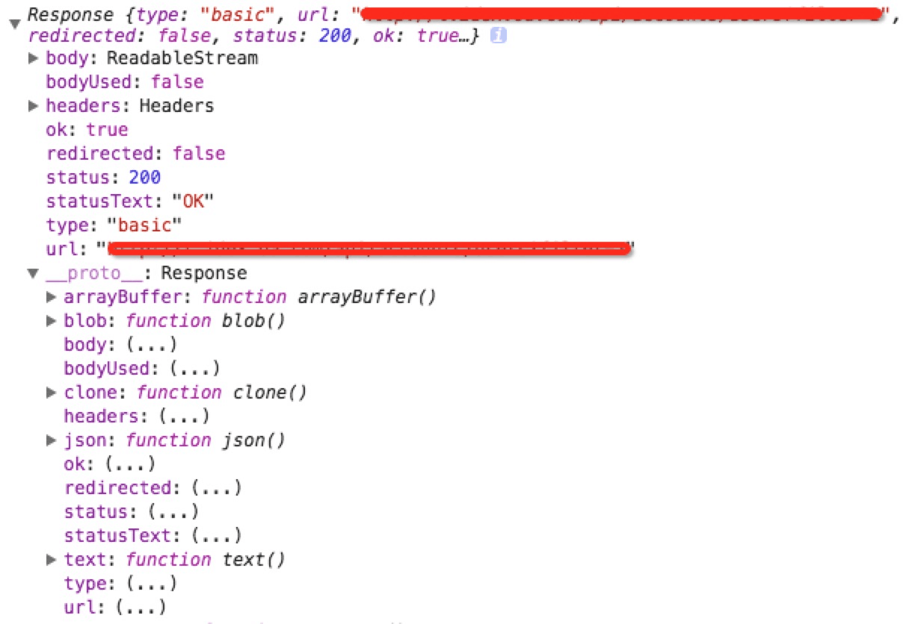

# Fetch-test

### Fetch demo 

#### 初步提供5种方法demo：
1. POST
2. GET
3. PUT
4. PATCH
5. DELETE

### 兼容性
>注意：由于Fetch API是基于Promise设计，旧浏览器不支持Promise，需要使用pollyfill es6-promise

说明：
1. fetch api返回的是一个promise对象
2. Options:  
   1. method(String): HTTP请求方法，默认为GET  
	 2. body(String): HTTP的请求参数
	 3. headers(Object): HTTP的请求头，默认为{}
	 4. credentials(String): 默认为omit,忽略的意思，也就是不带cookie;还有两个参数，same-origin，意思就是同源请求带cookie；include,表示无论跨域还是同源请求都会带cookie
3. 第一个then函数里面处理的是response的格式，这里的response具体如下：     
	
 
	1. status(number): HTTP返回的状态码，范围在100-599之间
	2. statusText(String): 服务器返回的状态文字描述，例如Unauthorized,上图中返回的是Ok
	3. ok(Boolean): 如果状态码是以2开头的，则为true
	4. headers:  HTTP请求返回头
	5. body:  返回体，这里有处理返回体的一些方法
		1. text(): 将返回体处理成字符串类型
		2. json()： 返回结果和 JSON.parse(responseText)一样
		3. blob()： 返回一个Blob，Blob对象是一个不可更改的类文件的二进制数据
		4. arrayBuffer()
		5. formData()

### 兼容性

> 要在不支持的浏览器中使用Fetch，可以使用[Fetch Polyfill]((http://example.net/))。

